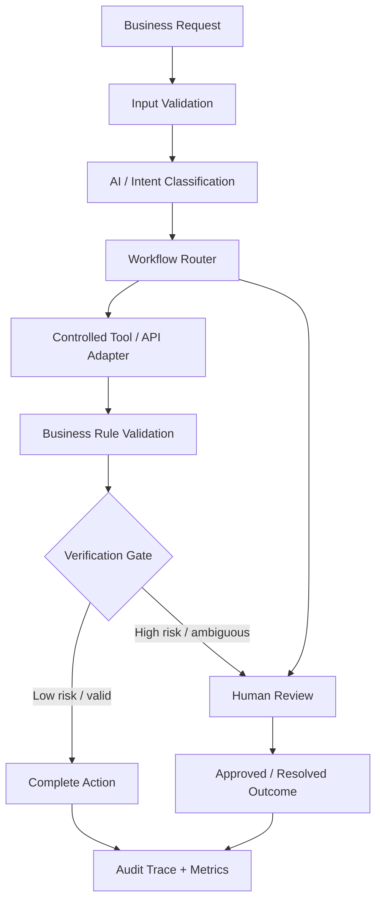

<p align="center">
  
</p>

<h1 align="center">Production AI Automation System</h1>

<p align="center">
  <strong>Context → Action → Verification.</strong><br>
  A production-oriented workflow for turning ambiguous business requests into controlled, auditable automation.
</p>

<p align="center">
  <a href="https://github.com/h00w/production-ai-automation/actions/workflows/ci.yml"></a>
  
  
  
  
</p>

<p align="center">
  <a href="https://pro-ai-automation.streamlit.app/"><strong>Live Demo</strong></a> ·
  <a href="docs/architecture.md">Architecture</a> ·
  <a href="docs/business_outcome.md">Business Outcomes</a> ·
  <a href="tests/">Tests</a> ·
  <a href="article/production_ai_automation_article.md">Technical Article</a>
</p>

---

## What this project demonstrates

Many AI prototypes optimize for a fluent answer. Production automation has a harder job: it must control **what enters the system, what actions are allowed, and how every outcome is verified**.

This project implements that idea as a small, inspectable business-operations automation system. An incoming request is validated, classified, routed through an explicit workflow, passed to a controlled tool boundary, checked against business rules, and either completed or escalated to a human.

It is deliberately designed as **production-style proof of work rather than a toy chatbot**.

<p align="center">
  <a href="https://pro-ai-automation.streamlit.app/"></a>
</p>

## Architecture at a glance



The design follows a simple **CAV Loop**:

| Layer | Responsibility | Production question |
|---|---|---|
| **Context** | Validate and structure incoming information | *Do we have the right data to make this decision?* |
| **Action** | Route work through explicit tools and workflows | *What is the system allowed to do?* |
| **Verification** | Apply rules, risk thresholds, checks, and escalation | *Should this outcome be accepted or reviewed?* |

## Live scenarios

The Streamlit application demonstrates several business-process paths:

| Scenario | Example behavior | Automation policy |
|---|---|---|
| **Sales lead** | Creates a structured lead record | Automated |
| **Technical support** | Creates a routed support ticket | Automated |
| **Billing** | Creates a billing-support workflow | Automated |
| **Order status** | Reads order state from a tool adapter | Automated when required data exists |
| **Refund** | Checks order and configured policy | Human approval for high-value cases |
| **Ambiguous request** | Routes safely to review | Human-in-the-loop |
| **Missing data** | Requests the missing information | No guessing / no silent completion |

### Example: consequential action

A high-value refund does **not** execute blindly. The system prepares the action, applies policy, and stops at a human-approval gate:

```text
Request
  ↓
Intent: refund
  ↓
Order lookup
  ↓
Policy validation
  ↓
Risk threshold exceeded
  ↓
Human approval required
  ↓
Auditable outcome
```

## Production controls

- **Schema-first contracts** using Pydantic
- **Explicit workflow states** instead of unconstrained agent behavior
- **Tool/API abstraction** separating reasoning from external side effects
- **Human-in-the-loop escalation** for ambiguous or consequential actions
- **Business-rule validation** around automated decisions
- **Safe failure paths** for missing or invalid information
- **Audit traces** for important state transitions
- **Regression tests** for core workflow behavior
- **GitHub Actions CI** using Python 3.12
- **Synthetic demonstration data** to avoid exposing customer information

## Repository map

```text
production-ai-automation/
│
├── app.py                         # Streamlit application
├── requirements.txt               # Runtime/test dependencies
├── pyproject.toml                 # Pytest configuration
├── Dockerfile                     # Container deployment
│
├── src/
│   ├── models.py                  # Structured request/result contracts
│   ├── workflow.py                # Core orchestration and policy logic
│   └── adapters.py                # External tool/API boundary
│
├── tests/
│   └── test_workflow.py           # Regression tests
│
├── docs/
│   ├── architecture.md            # Architecture and design decisions
│   ├── business_outcome.md        # KPI and outcome framework
│   └── walkthrough_script.md      # Demo walkthrough
│
├── article/
│   ├── production_ai_automation_article.md
│   └── production_ai_automation_article.html
│
└── .github/
    └── workflows/
        └── ci.yml                 # Automated validation
```

## Run locally

### 1. Clone

```bash
git clone https://github.com/h00w/production-ai-automation.git
cd production-ai-automation
```

### 2. Create a virtual environment

Windows PowerShell:

```powershell
py -3.12 -m venv .venv
.\.venv\Scripts\Activate.ps1
```

macOS / Linux:

```bash
python3.12 -m venv .venv
source .venv/bin/activate
```

### 3. Install dependencies

```bash
python -m pip install --upgrade pip
python -m pip install -r requirements.txt
```

### 4. Validate the implementation

```bash
python -m pytest -q
```

### 5. Run the application

```bash
python -m streamlit run app.py
```

Then open `http://localhost:8501`.

## Validation strategy

The repository separates **functional proof**, **test evidence**, and **production business outcomes**.

Automated tests validate core workflow behavior such as:

- successful low-risk automation
- high-value refund escalation
- missing-data handling
- safe routing of ambiguous requests

GitHub Actions reproduces the test suite on every push and pull request.

> [!IMPORTANT]
> Metrics and outcomes in this repository are demonstration or synthetic-test evidence unless explicitly identified otherwise. The project does **not** claim unverified customer ROI, revenue uplift, or production workload reduction.

## Business outcome framework

A production deployment should measure outcomes rather than rely on qualitative claims. The companion [business outcome document](docs/business_outcome.md) defines metrics including:

- automation rate
- mean handling time
- safe escalation rate
- classification accuracy
- false-automation rate
- tool/API failure rate
- duplicate-action rate
- cost per completed workflow
- audit completeness

The principle is straightforward: **measure business impact after deployment; do not fabricate it in the prototype.**

## Scaling path

The current proof uses deterministic local adapters so reviewers can execute it without credentials. The architecture intentionally keeps integrations replaceable.

A production evolution can connect the same workflow boundaries to:

- OpenAI, Claude, Gemini, or other model providers
- HubSpot, Salesforce, Zendesk, Stripe, or internal APIs
- n8n, Make, Zapier, Temporal, or LangGraph orchestration
- PostgreSQL, warehouses, or SIEM/audit stores
- OpenTelemetry and production observability platforms

Mentioning these systems describes the **integration path**, not integrations claimed as already implemented in this repository.

## Design principle

> **AI may propose. Software validates. Policy authorizes. Tools execute within boundaries. Verification decides whether the workflow is complete.**

That principle is the core of this project: production AI automation should be useful enough to remove repetitive work, but controlled enough that consequential actions remain inspectable, recoverable, and auditable.

## Proof of work

This repository is part of a professional AI & automation portfolio demonstrating the complete engineering lifecycle:

**Design → Implement → Test → Deploy → Document → Measure**

- **Live application:** https://pro-ai-automation.streamlit.app/
- **Architecture:** [docs/architecture.md](docs/architecture.md)
- **Business outcomes:** [docs/business_outcome.md](docs/business_outcome.md)
- **Technical article:** [Beyond the AI Demo: Engineering Automation That Survives Production](article/production_ai_automation_article.md)
- **CI:** [GitHub Actions](https://github.com/h00w/production-ai-automation/actions/workflows/ci.yml)

## Author

**Hendarmawan, PhD Eng.**  
AI Automation · Production AI · Edge AI · System Architecture · Secure AI Infrastructure

[LinkedIn](https://www.linkedin.com/in/hender/) · [GitHub](https://github.com/h00w) · [LIFE-AI](https://www.life-ai.se/) · [Live Demo](https://pro-ai-automation.streamlit.app/)

---

<p align="center">
  <strong>Production AI should not stop at a successful model response.</strong><br>
  It should remain testable, observable, controlled, and recoverable after deployment.
</p>
