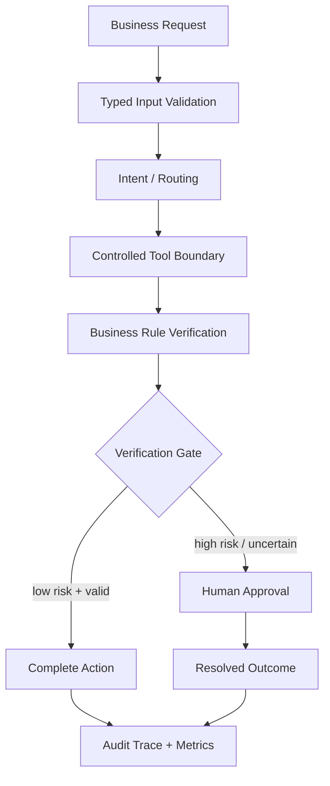

<p align="center">
  <a href="https://pro-ai-automation.streamlit.app/">
    
  </a>
</p>

<h1 align="center">Production AI Automation</h1>

<p align="center">
  <strong>AI Workflow Engineering</strong><br>
  Production-oriented workflow automation with typed contracts, tool boundaries, business-rule verification, human approval and auditable outcomes.
</p>

<p align="center">
  <a href="https://pro-ai-automation.streamlit.app/"><strong>Live Demo ↗</strong></a> ·
  <a href="docs/architecture.md"><strong>Architecture</strong></a> ·
  <a href="docs/business_outcome.md"><strong>Business Outcomes</strong></a> ·
  <a href="article/production_ai_automation_article.md"><strong>Technical Article</strong></a>
</p>

<p align="center">
  <a href="https://github.com/h00w/production-ai-automation/actions/workflows/ci.yml"></a>
  
  
  
</p>

---

## Why this project exists

AI prototypes often optimize for a fluent response. Production automation has a harder requirement: it must control **what enters the system, what actions are allowed, how outputs are verified, what happens when quality is insufficient, and when a human must intervene**.

This repository turns ambiguous business requests into inspectable workflows with validation, intent routing, bounded tools, business rules, explicit verification gates, human escalation, and an audit trail.

> **AI may propose. Software validates. Policy authorizes. Tools execute within boundaries. Verification decides whether the workflow is complete.**

## Control model

The implementation follows a simple Context → Action → Verification loop:



## What the project demonstrates

| Layer | Engineering control | Production question |
| --- | --- | --- |
| Context | typed contracts and validation | do we have enough trustworthy data? |
| Routing | explicit workflow selection | which workflow is allowed to act? |
| Tool boundary | controlled adapters | what external side effects are permitted? |
| Business rules | deterministic checks | does the proposed action satisfy policy? |
| Human approval | escalation state | should a person authorize this outcome? |
| Verification | accept / review decision | can this workflow safely complete? |
| Audit | structured trace | can the decision be reconstructed later? |

## Safe failure behavior

The workflow is designed to stop safely rather than guess:

- missing data → request additional information;
- ambiguous intent → route to human review;
- policy violation → block automatic completion;
- consequential action → require approval;
- invalid tool result → stop the workflow;
- failed regression expectation → fail CI before release.

A failed evaluation becomes an explicit system state, not an uncontrolled side effect.

## Example scenarios

| Scenario | Behavior | Policy |
| --- | --- | --- |
| Sales lead | create structured lead record | automated |
| Technical support | route support ticket | automated |
| Billing | create billing workflow | automated |
| Order status | read from bounded adapter | automated when data exists |
| High-value refund | validate policy and amount | human approval |
| Ambiguous request | prepare context for review | human-in-the-loop |
| Missing data | request required field | no guessing |

## Production controls

- Pydantic schema-first contracts
- explicit workflow states
- bounded tool/API abstraction
- business-rule validation
- human approval for consequential actions
- safe failure paths
- audit traces for important transitions
- regression tests
- GitHub Actions CI
- synthetic demonstration data only

## Evaluation and release discipline

The same architecture extends naturally to prompts, models, and agents:

**Change → Evaluate → Compare → Diagnose → Approve / Reject → Add Regression Case**

A production evaluation suite can add factuality, relevance, instruction adherence, tool correctness, safety, latency, cost, and policy compliance while preserving the same principle: **separate evidence dimensions and make blocking criteria explicit**.

## Run locally

```bash
git clone https://github.com/h00w/production-ai-automation.git
cd production-ai-automation
python -m venv .venv
python -m pip install -r requirements.txt
python -m pytest -q
python -m streamlit run app.py
```

## Business outcome discipline

The repository separates engineering proof from business claims. Production deployments should measure metrics such as automation rate, handling time, safe escalation rate, false-automation rate, tool failure rate, cost per completed workflow, and audit completeness.

Demonstration values are not presented as customer ROI. See [`docs/business_outcome.md`](docs/business_outcome.md).

## Scaling path

The deterministic adapters are intentionally replaceable. The same boundaries can be connected to model providers, CRM/support systems, payment APIs, workflow engines, databases, and observability platforms without changing the central governance model.

## Proof chain

**Architecture → Typed Contracts → Controlled Tools → Verification → Human Approval → Tests → CI → Live Demo**

- Live application: https://pro-ai-automation.streamlit.app/
- Architecture: [`docs/architecture.md`](docs/architecture.md)
- Business outcomes: [`docs/business_outcome.md`](docs/business_outcome.md)
- Tests: [`tests/`](tests/)
- Technical article: [`article/production_ai_automation_article.md`](article/production_ai_automation_article.md)

## Author

**Hendarmawan, PhD Eng.**  
Production AI · AI Automation · Agentic Systems · AI Evaluation · Secure AI Infrastructure

[Website](https://hendarmawan.se) · [LinkedIn](https://www.linkedin.com/in/hender/) · [GitHub](https://github.com/h00w)
